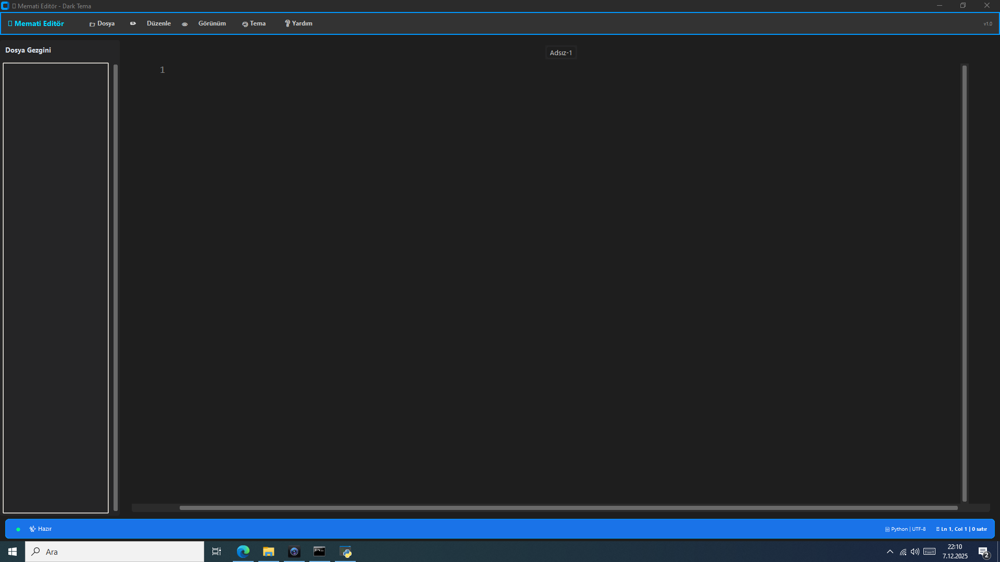

# 🪐 Memati Editör

**Modern, Hafif ve Güçlü Bir Python IDE'si**

[](https://www.python.org/downloads/)
[](https://github.com/TomSchimansky/CustomTkinter)
[](LICENSE)
[](https://github.com/Memati8383/Advanced-Text-Editor)
[](https://github.com/psf/black)

<br>
<p align="center">
  <b>Memati Editör</b>; hız, estetik ve üretkenliği bir araya getiren <i>yeni nesil</i> bir kod editörüdür.
  <br><br>
  Modern <b>CustomTkinter</b> arayüzü, akıllı kodlama yardımcıları ve göz alıcı temaları ile
  hem başlangıç seviyesindeki kullanıcılara hem de profesyonellere <b>premium</b> bir deneyim sunar.
  <br>
  <i>Sadece kod yazmayın, kodun sanatını icra edin.</i>
</p>



---

## ✨ Öne Çıkan Özellikler

### 🚀 **Gelişmiş Kodlama Araçları**
- **🧠 Akıllı Otomatik Tamamlama**: Yazarken size yardımcı olan bağlamsal öneriler.
- **📂 Kod Katlama (Code Folding)**: Fonksiyon ve sınıf bloklarını katlayarak kod karmaşasını azaltın.
- **⚖️ Akıllı Girinti & Parantez**: Otomatik girinti ve parantez/tırnak kapatma ile hatasız yazım.
- **🖱️ Çoklu İmleç**: Alt+Click ile birden fazla yerde aynı anda düzenleme yapın.
- **🗺️ Mini Harita (Minimap)**: Dosyanızın önizlemesi ile büyük dosyalarda kaybolmadan gezinin.
- **🔍 Gelişmiş Arama**: Regex destekli güçlü Bul ve Değiştir aracı.
- **🔢 Satıra Git**: `Ctrl+G` ile kodunuzun derinliklerine hızla ulaşın.
- **📝 Markdown Önizleme**: Canlı önizleme, senkronize kaydırma, kelime sayımı ve modern arayüz (Ctrl+Shift+V).
- **🖼️ Resim Görüntüleyici**: Yerleşik görüntüleyici ile resim dosyalarını (PNG, JPG, vb.) doğrudan açın.

### 🎨 **Modern Arayüz & Deneyim**
- **💎 17 Premium Tema**: Dracula, Monokai, Solarized, Nord, One Dark Pro ve daha fazlası.
- **📊 Gelişmiş Durum Çubuğu**: Dinamik ikonlar, hover efektleri ve detaylı bilgi gösterimi.
- **🔎 Dinamik Yakınlaştırma**: `Ctrl + Tekerlek` ile editör yazı boyutunu ölçeklendirin.
- **📑 Sekme Yönetimi**: Sürükle-bırak destekli, sağ tık menülü gelişmiş sekme sistemi.
- **🧘 Zen Modu**: `Ctrl+K, Z` ile arayüzü gizleyip sadece editöre odaklanın.
- **📁 Gelişmiş Dosya Gezgini**: Ağaç yapısı, her dosya formatı için özel ikonlar.
- **⌨️ Entegre Terminal**: PowerShell/Bash desteği, tema uyumu ve çoklu sekme.
- **🌍 Çoklu Dil Desteği**: Türkçe, İngilizce ve Azerbaycan Türkçesi desteği.

### 🛡️ **Güvenlik ve Performans**
- **💾 Sessiz Otomatik Kayıt**: Kodunuzu yazarken arka planda otomatik olarak güvenceye alın.
- **👀 Canlı Dosya İzleme**: Harici değişiklikleri anında algılar.
- **📊 Performans İzleme**: CPU, RAM ve Uptime takibi.

---

## 📚 Dokümantasyon

Detaylı kullanım rehberleri için `docs/` klasörüne göz atın:

*   **[📥 Kurulum Rehberi](docs/INSTALLATION.md):** Adım adım kurulum yönergeleri.
*   **[✨ Özellikler](docs/FEATURES.md):** Tüm özellikleri detaylıca keşfedin.
*   **[⌨️ Klavye Kısayolları](docs/SHORTCUTS.md):** Tam kısayol listesi.
*   **[🎨 Tema Rehberi](docs/THEMES.md):** Tema galerisi ve özelleştirme.
*   **[🤝 Katkıda Bulunma](docs/CONTRIBUTING.md):** Projeye katkı sağlama rehberi.

---

## 🛠️ Kurulum ve Çalıştırma

### Gereksinimler
- **Python 3.10** veya daha yeni bir sürüm.
- **Git** (isteğe bağlı).

### ⚡ Hızlı Başlangıç

1. **Projeyi Klonlayın**
   ```bash
   git clone https://github.com/Memati8383/Advanced-Text-Editor.git
   cd Advanced-Text-Editor
   ```

2. **Sanal Ortam Oluşturun (Önerilen)**
   ```bash
   # Windows
   python -m venv venv
   .\venv\Scripts\activate

   # macOS/Linux
   python3 -m venv venv
   source venv/bin/activate
   ```

3. **Bağımlılıkları Yükleyin**
   ```bash
   pip install customtkinter pygments watchdog psutil
   ```
   *(Not: `requirements.txt` varsa `pip install -r requirements.txt` kullanabilirsiniz)*

4. **Uygulamayı Başlatın**
   ```bash
   python run_editor.py
   ```

---

## ⌨️ Klavye Kısayolları (Özet)

| Kategori | Kısayol | İşlem |
| :--- | :--- | :--- |
| **📁 Dosya** | <kbd>Ctrl</kbd> + <kbd>N</kbd> | Yeni Sekme Aç |
| | <kbd>Ctrl</kbd> + <kbd>S</kbd> | Kaydet |
| **✏️ Düzenleme** | <kbd>Ctrl</kbd> + <kbd>F</kbd> | Bul ve Değiştir |
| | <kbd>Ctrl</kbd> + <kbd>G</kbd> | Satıra Git |
| **🖱️ Çoklu İmleç** | <kbd>Alt</kbd> + <kbd>Click</kbd> | Yeni İmleç Ekle |
| | <kbd>Ctrl</kbd> + <kbd>D</kbd> | Kelimeyi Seç |
| **👁️ Görünüm** | <kbd>Ctrl</kbd> + <kbd>M</kbd> | Minimap Aç/Kapat |
| | <kbd>Ctrl</kbd> + <kbd>B</kbd> | Dosya Gezgini |
| | <kbd>Ctrl</kbd> + <kbd>Shift</kbd> + <kbd>V</kbd> | Markdown Önizleme |
| **⚙️ Ayarlar** | <kbd>Ctrl</kbd> + <kbd>,</kbd> | Ayarlar Penceresi |

*Daha fazla kısayol için [SHORTCUTS.md](docs/SHORTCUTS.md) dosyasına bakınız.*

<div align="center">
  <br>
  <p><sub>Bu proje <b>MIT Lisansı</b> altında lisanslanmıştır.</sub></p>
  <p>Copyright © 2025 Memati. Tüm Hakları Saklıdır.</p>
</div>

