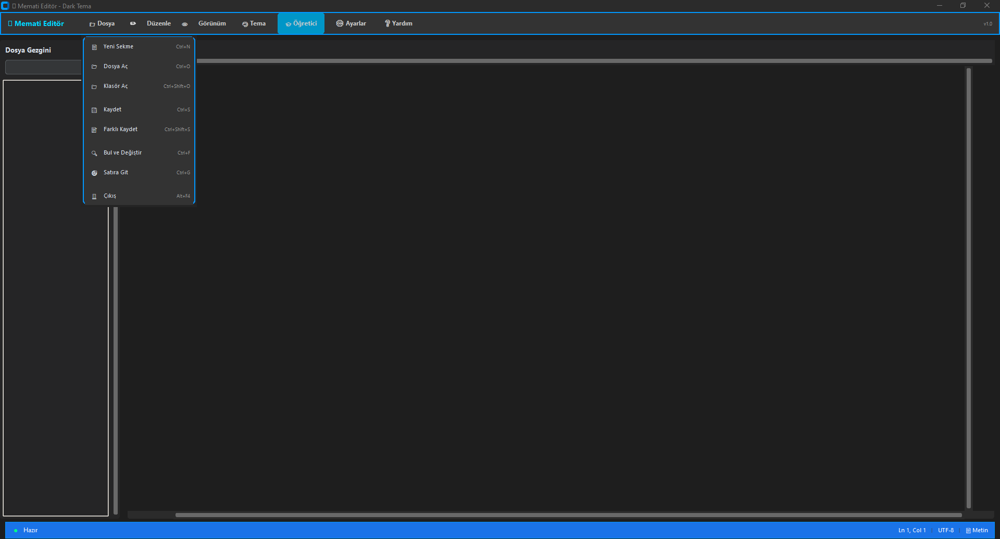
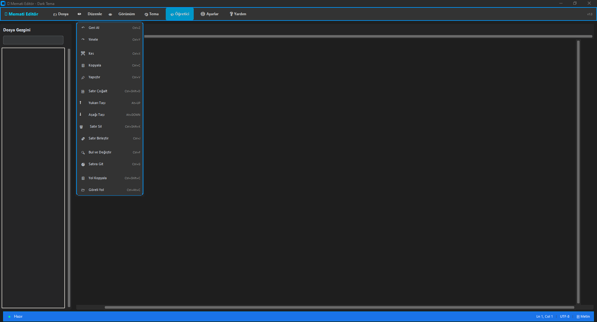
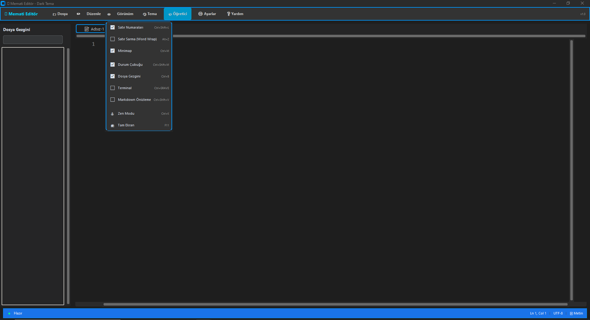
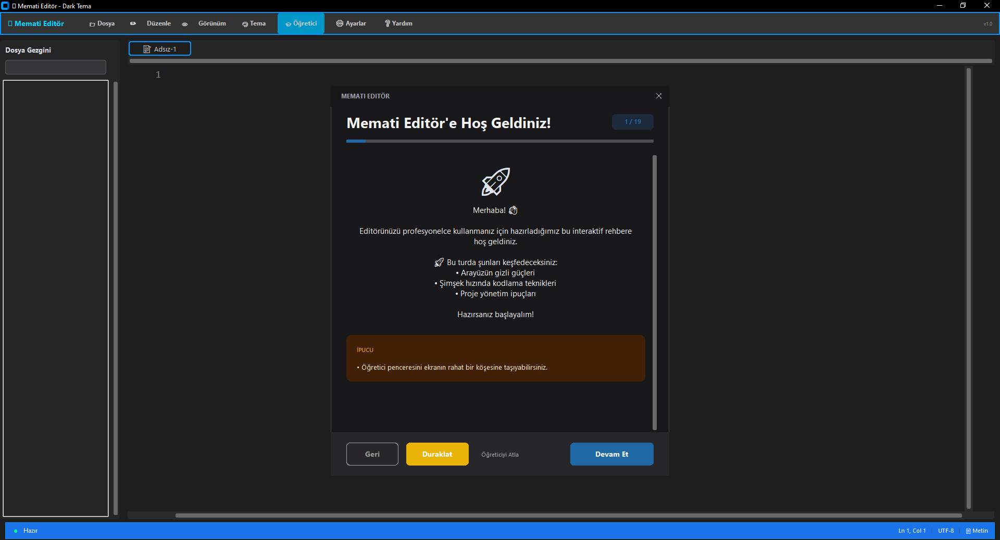
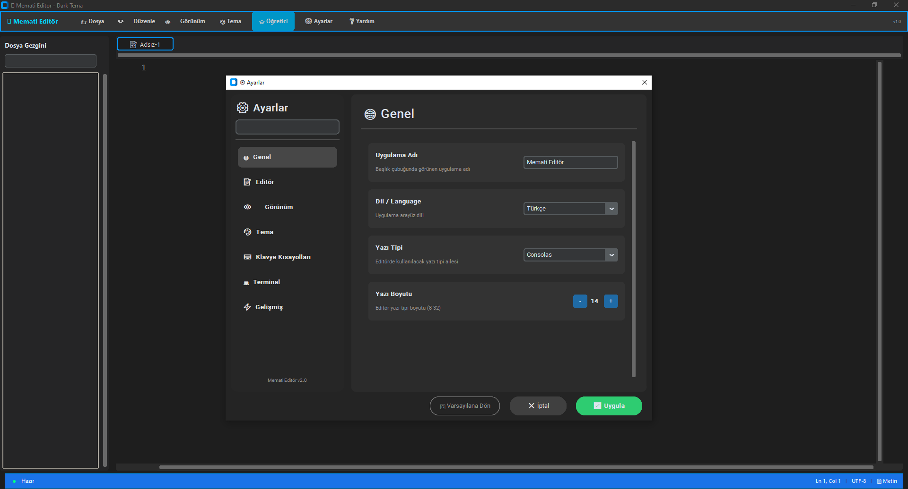

# Ekran Görüntüleri

Bu dizin, **Gelişmiş Metin Editörü** projesine ait ekran görüntülerini ve görsel materyalleri içerir.  
Bu görseller, projenin özelliklerini sergilemek, belgelendirmek ve kullanıcı arayüzü hakkında önizleme sunmak amacıyla kullanılmaktadır.

## Mevcut Görseller

Aşağıdaki ekran görüntüleri uygulamanın çeşitli menülerini ve özelliklerini göstermektedir:

| Dosya Adı        | Açıklama |
|-------------------|----------|
|   | **Ana Pencere:** Uygulamanın genel görünümü ve editör arayüzü. |
|  | **Dosya Menüsü:** Dosya açma, kaydetme ve diğer dosya işlemleri menüsü. |
|  | **Düzenle Menüsü:** Kes, kopyala, yapıştır ve bul/değiştir gibi düzenleme araçları. |
|  | **Görünüm Menüsü:** Arayüz özelleştirme, yakınlaştırma ve kenar çubuğu seçenekleri. |
|  | **Tema Seçenekleri:** Farklı renk temaları ve görünüm ayarları. |
|  | **Yardım Penceresi:** Kullanıcı kılavuzu, kısayollar ve hakkında bilgileri. |
|  | **Öğretici:** Kullanıcıya uygulamanın nasıl kullanılacağını anlatan adım adım rehber. |
|  | **Ayarlar Menüsü:** Kullanıcı tercihlerine göre ayarları düzenleme imkanı. |

---

*Not: Bu görseller projenin ana `README.md` dosyasında ve dokümantasyonunda referans olarak kullanılabilir.*

